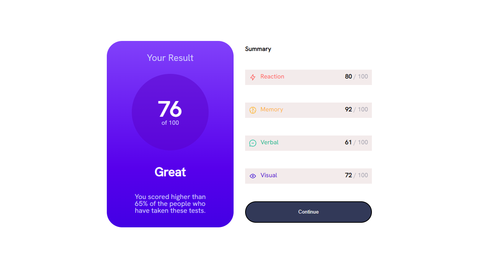
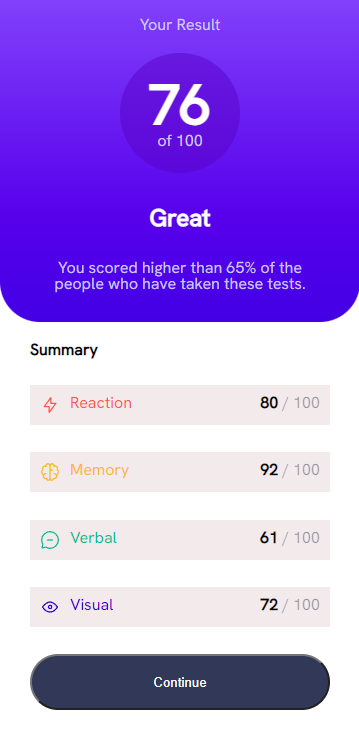

# Frontend Mentor - Results summary component solution


## Table of contents

- [Overview](#overview)
  - [The challenge](#the-challenge)
  - [Screenshots](#screenshots)
  - [Links](#links)
- [My process](#my-process)
  - [Built with](#built-with)
  - [What I learned](#what-i-learned)
  - [Continued development](#continued-development)
  - [Useful resources](#useful-resources)
- [Author](#author)

## Overview

### The challenge

Users should be able to:

- View the optimal layout for the interface depending on their device's screen size
- See hover and focus states for all interactive elements on the page

### Screenshots

##### Desktop View




##### Mobile View




### Links

- Solution URL: [Github Repo](https://github.com/DeviantSchemist/resultssummarycomponent)
- Live Site URL: [Live Site](https://sparkling-longma-26c3c3.netlify.app/)

## My process

### Built with

- Semantic HTML5 markup
- CSS custom properties
- SASS
- Flexbox
- Mobile-first workflow

### What I learned

I built the component using standard HTML5 and CSS. I worked in a mobile first workflow, making all the styles for the mobile view first, then the desktop view. I recognize the importance of this workflow and how it affects development time. Semantic HTML was added in order to be complaint with accessibility standards.

I used SASS for the styling. This was my first time working on a project using this. I especially loved the ability to nest CSS styles, which made editing styles SO much easier for me.

I used plain Javascript in order to fetch the data from the JSON file and render it into the HTML. However, the data fetching does not work unless the JSON file is uploaded to a live server. I was able to circumvent this problem by using the Live Server extension in VS Code.

**See below for how I accomplished the JSON rendering**:

```html
<section class="results">
  <h2>Summary</h2>
  <section class="chart" id="displayChart">
  </section>
  <button class="hand-cursor">Continue</button>
</section>
```

```js
const displayData = jsonData => {
  document.getElementById("displayChart")
    .innerHTML += `
      <article class="first-bar">
        <div>
          
          <p>${jsonData[0].category}</p>
        </div>
        <p><span class="bold">${jsonData[0].score}</span> <span class="light-navy">/ 100</span></p>
      </article>
      <article class="second-bar">
        <div>
          
          <p>${jsonData[1].category}</p>
        </div>  
        <p><span class="bold">${jsonData[1].score}</span> <span class="light-navy">/ 100</span></p>
      </article>
      <article class="third-bar">
        <div>
          
          <p>${jsonData[2].category}</p>
        </div>
        <p><span class="bold">${jsonData[2].score}</span> <span class="light-navy">/ 100</span></p>  
      </article>
      <article class="fourth-bar">
        <div>
          
          <p>${jsonData[3].category}</p>
        </div>
        <p><span class="bold">${jsonData[3].score}</span> <span class="light-navy">/ 100</span></p>  
      </article>
    `
}

const handleDisplay = () => {
  fetch("./data.json")
    .then(response => response.json())
    .then(json => displayData(json))
    .catch(err => console.error(err));
}
```


### Continued development

I will continue focusing on writing accessible code. Accessibility is something that is very important in web development, and unfortunately many websites nowadays are not as accessible as they should be.

I will expand my knowledge of CSS flexbox, grid, and in general. My recent experience has been with using CSS within frameworks such as Tailwind and Bootstrap, which bloats HTML code. Using SASS for this project has helped me level up my CSS skills and write cleaner code.

I will focus on achieving pixel perfect designs and responsive development. I realize I still have much to learn regarding this, and increasing my skill in these areas will be valuable for me as a web developer.

### Useful resources

- [CSS Reset](https://meyerweb.com/eric/tools/css/reset/) - I use this CSS reset file for almost every project I work on. It is very thorough. (A "CSS Reset" file eliminates the default styling that many browsers have, enabling you to work on styling without any hidden styles already put there by the browser.)

## Author

- Frontend Mentor - [@DeviantSchemist](https://www.frontendmentor.io/profile/DeviantSchemist)
